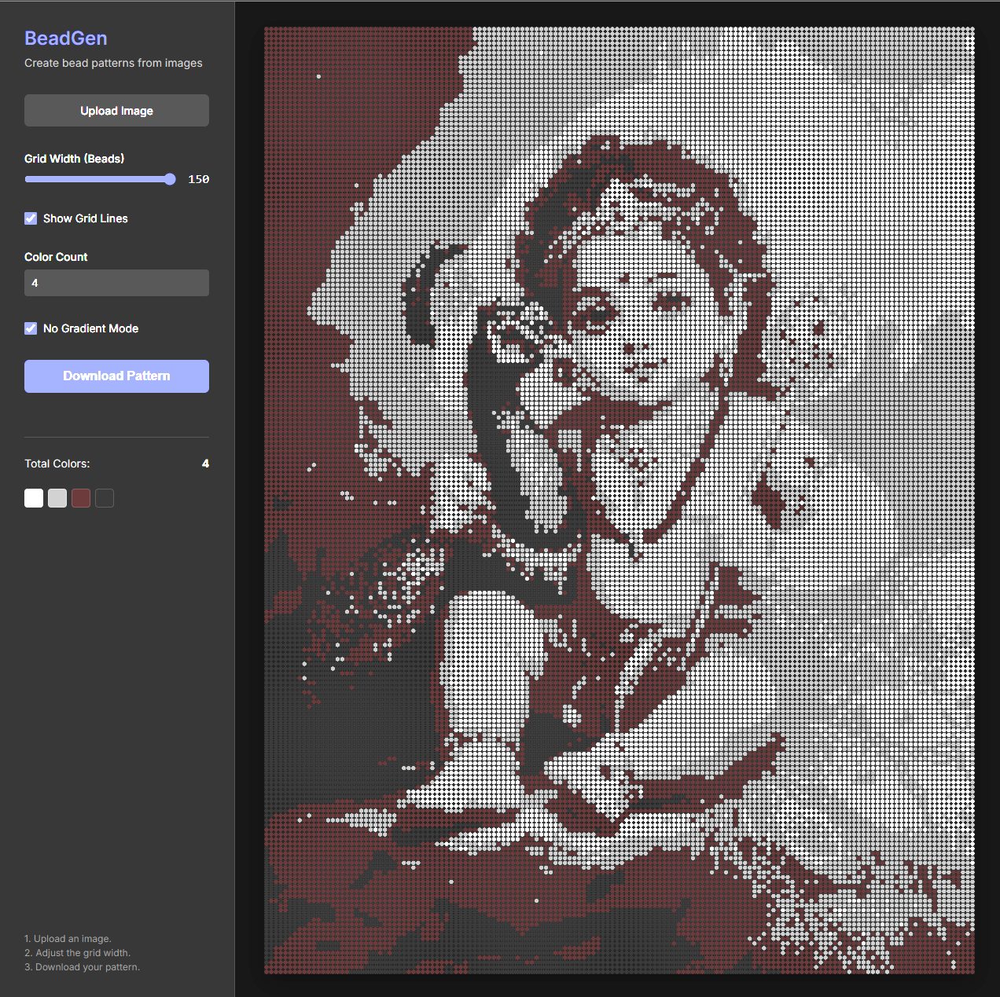

# Bead Stitching Image Generator

A browser-based tool that transforms images into bead stitching patterns. It simplifies images into a grid of "beads", reduces color palettes, and generates downloadable patterns for crafters.

## Features

- **Image Upload**: Drag and drop or select any image to convert.
- **Adjustable Grid**: Control the width of the bead grid (pattern resolution).
- **Color Control**:
  - **Color Count**: Limit the palette to a specific number of colors (e.g., 10, 20) using the **Median Cut algorithm** for high-quality reduction, or use "max" for full color.
  - **No Gradient Mode**: simplify the pattern by flattening subtle color transitions into solid bands, making it easier to stitch.
- **Stats & Palette**: View the total number of colors used and visual swatches of the exact palette.
- **Grid Visualization**: Toggle grid lines on/off for better visualization.
- **Export**: Download the final pattern as a PNG image.

## Usage

1.  **Upload Image**: Click "Upload Image" to select your source photo.
2.  **Adjust Size**: Use the slider to set how many beads wide your project should be.
3.  **Refine Colors**:
    - Enter a number in **Color Count** (e.g., `12`) to get a manageable palette.
    - Check **No Gradient Mode** if you want a cleaner, "posterized" look.
4.  **Review**: Check the "Total Colors" stat and palette grid below the controls.
5.  **Download**: Click "Download Pattern" to save your design.

## Technologies

- HTML5 / CSS3
- Vanilla JavaScript (Canvas API)
- Median Cut Algorithm for color quantization

## Example Output

